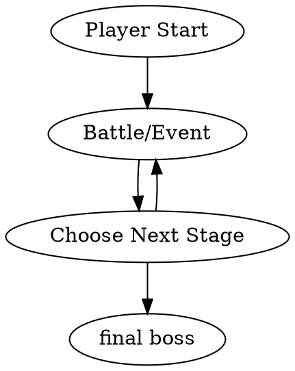
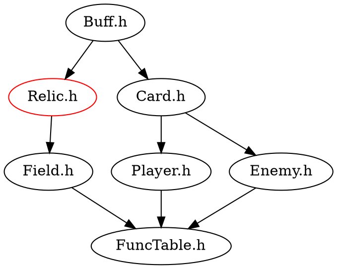
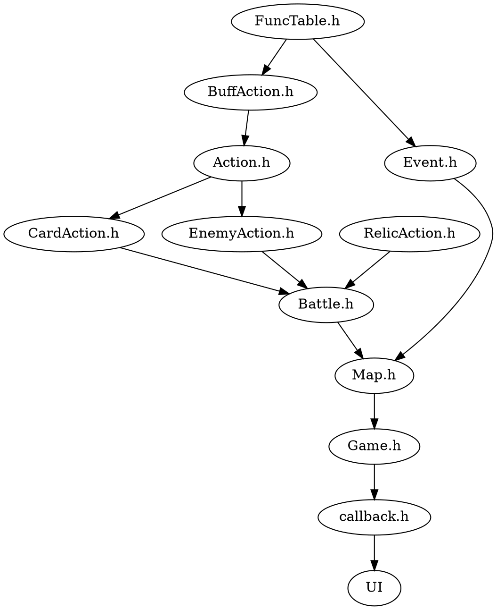
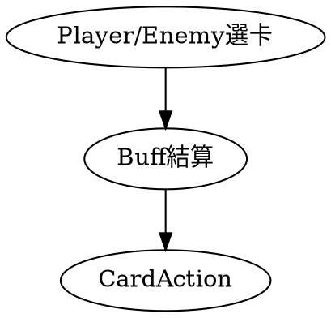
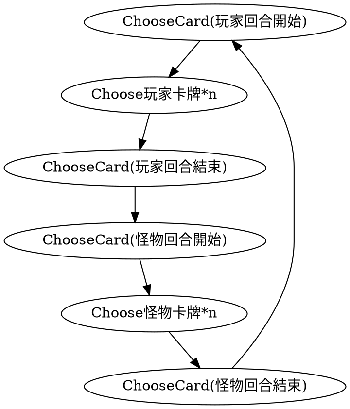

# Programming Design Final Project

## The Rogue Game

### GroupMembers: 羅冠翔 顏鈺峰 莊順閎 王政崴 王子奕

## 1. Introduction

### Game Intro

Rough: The Card Game
It is a game that combines elements of card games and roguelikes.

The game allows players to assume the role of an adventurer, exploring uncharted territories filled with danger and mysterious trials. Players must construct powerful decks of cards and employ strategies to overcome various enemies and challenges.

Players need to choose cards to play each turn and respond to enemy attacks and abilities. Strategically using cards, managing resources, and health points are key to achieving victory in the game.

### Game Flow



## 2. Program Design

Program Flow



### Program Flow



### Choose Card



### Battle



## 4.Advance Part

### GUI

```clike=

void StartButton_clicked_cb(GtkWidget *widget, gpointer data);

void SettingButton_clicked_cb(GtkWidget *widget, gpointer data);

void MainStack_visible_child_name_notify_cb(GObject *gobject, GParamSpec *pspec, gpointer user_data);

void DrawCardDeckButton_clicked_cb(GtkWidget *widget, gpointer data);

void BattleRoundEndButton_clicked_cb(GtkWidget *widget, gpointer data);

void setting_button_clicked(GtkWidget *widget, gpointer data);

void quit_button_clicked(GtkWidget *widget, gpointer data);

void event_button_clicked(GtkButton *button, gpointer data);

void battle_button_clicked(GtkButton *button, gpointer data);

```

## 5. demo

# FP_finalproject

## build

```bash=
brew install gtk+3
git clone https://github.com/MixnightE/FP_finalproject.git
# 主要是確定有<gtk/gtk.h>
cd our/project/place/directory # clone的資料夾
make
./myproject
```

The start


The battle


github link
https://github.com/CCU5703/ProgrammingDesign_FinalProject.git
